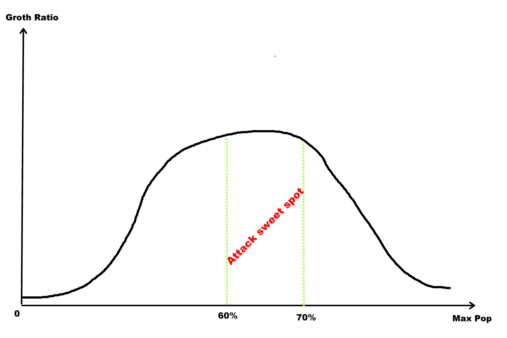

# 🎮 OpenFront Chrome Extension

Enhance your OpenFront.io gaming experience with population tracking and lofi music! 🚀

## ✨ Features

- **Population Display** 📊
  - Shows current/total population at the top of the screen
  - Large percentage display for quick reference
  - Color-coded values for better readability
- **Why Track Population?** 🎯
  - **Optimal Attack Timing**: To maximize your population growth, you should attack when you're around 60-70% of your maximum population capacity
  - **Strategic Advantage**: Real-time percentage display helps you identify the perfect moment to launch attacks for maximum efficiency
  - **Resource Management**: Avoid attacking too early (wasted potential) or too late (missed opportunities)
  - **Visual Learning**: The growth curve below shows the mathematical relationship between current population and optimal attack timing
  
  
  
  *The sweet spot for attacks is in the highlighted zone where population growth rate is optimized*

- **Lofi Music Player** 🎵
  - Click the lofi girl button to start/stop chill background music
  - Perfect for maintaining focus during long gaming sessions
  - Unobtrusive YouTube embed that plays in the background

## 🚀 Installation

1. Download or clone this repository
2. Open Chrome and go to `chrome://extensions/`
3. Enable "Developer mode" in the top right
4. Click "Load unpacked" and select the extension directory
5. Visit `https://openfront.io/join/[game-id]` to start using

## 💡 Usage

The extension automatically activates when you join a game. The population display appears at the top of the screen and updates in real-time.

- 💚 Green: Current population
- 🟡 Amber: Maximum population
- 🔵 Blue: Percentage (enlarged for visibility)

Click the lofi girl button on the right side of the screen to toggle background music on/off.

## License

MIT License - Feel free to modify and share!

Vibe Coded with love for the OpenFront community! 💖
